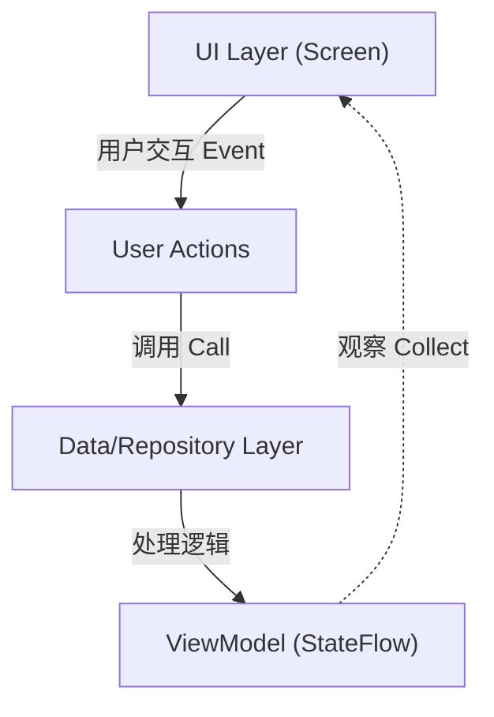
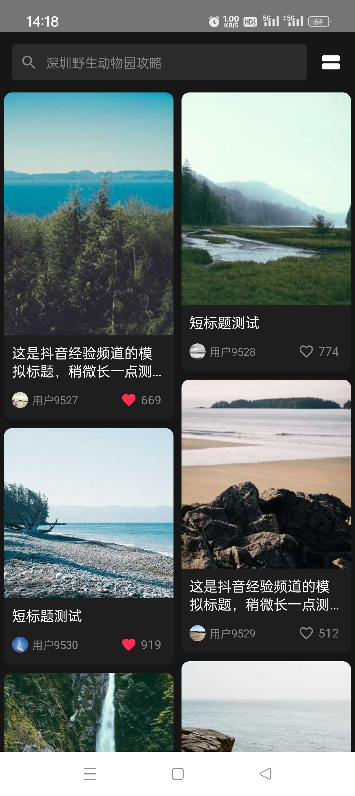
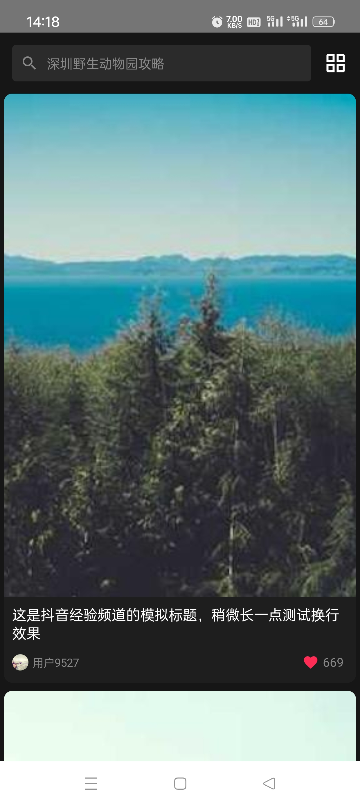
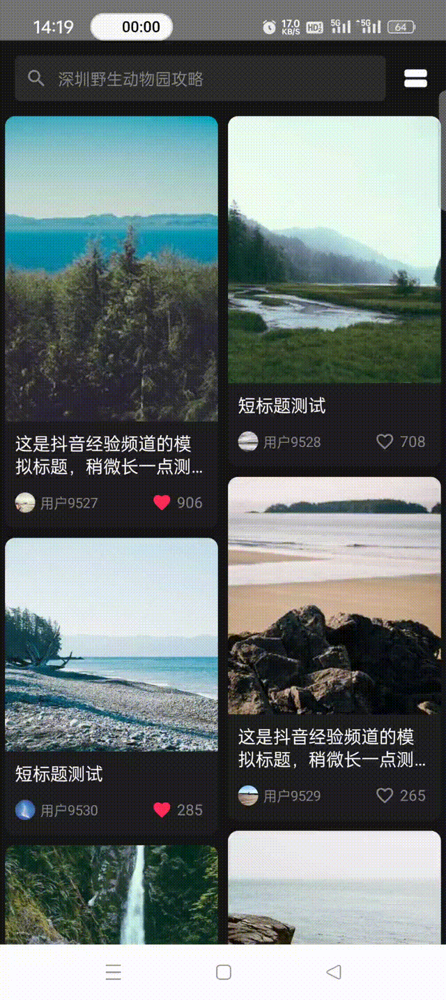

# 📱 仿抖音“经验”频道 (Douyin Experience Channel Clone)

> 基于 **Jetpack Compose + MVVM** 架构实现的沉浸式双列瀑布流应用。
>
> An immersive waterfall flow application built with Modern Android Development standards.

  

## 📖 1. 项目背景与价值定义 (Project Value)

### 从 0 到 1 的思考：为什么我们需要“经验”频道？

抖音传统的单列沉浸式流适合“Kill Time”（消磨时间），用户被动接收算法推荐；而**“经验”频道**采用了**双列瀑布流**布局，其核心价值在于：

1. **提高信息密度**：同屏展示 4-6 个卡片，让用户拥有“选择权”，更适合寻找攻略、避雷、种草等高价值信息。
2. **激发主动探索**：通过封面和标题吸引点击，服务于用户的特定需求，从而增加长尾内容的曝光。
3. **用户体验差异化**：经验频道完美复刻了这种“逛”的体验，在有限的移动端屏幕上实现了视觉美感与信息效率的平衡。

------

## 🛠 2. 技术选型与架构设计 (Tech Stack & Architecture)

本项目完全采用谷歌推荐的 **Modern Android Development (MAD)** 技术栈。在技术选型上，我遵循“**拥抱未来、效率优先**”的原则。

### 核心技术栈

|   技术组件   | 选型                  | 选型理由 (Why?)                                              |
| :----------: | :-------------------- | :----------------------------------------------------------- |
| **UI 框架**  | **Jetpack Compose**   | 相比 XML + RecyclerView，Compose 的声明式 UI 代码量要少很多。其内置的 `LazyVerticalStaggeredGrid` 原生支持瀑布流，解决了传统 View 体系下实现瀑布流极其繁琐（需要自定义 LayoutManager）的痛点。 |
| **架构模式** | **MVVM**              | 实现了 UI (View) 与 业务逻辑 (ViewModel) 的彻底解耦。使用 `StateFlow` 进行单向数据流管理，确保了数据的一致性，便于单元测试和后期维护。 |
| **图片加载** | **Coil**              | 专为 Kotlin 和 Compose 打造。相比 Glide，它更轻量，且原生支持 Coroutine（协程），其默认的内存/磁盘三级缓存策略直接覆盖了本项目的加分项需求。 |
| **异步处理** | **Coroutines + Flow** | 取代传统的 Thread/Handler，以同步的方式写异步代码，优雅地处理了网络模拟、延时加载等耗时操作，避免了回调地狱。 |

### 架构设计图 (Architecture)

本项目采用经典的单向数据流 (Unidirectional Data Flow) 模式：



------

## ✨ 3. 功能特性 (Features)

- **核心功能**：
  -  **高性能瀑布流**：支持动态高度适配，滑动流畅不掉帧。
  -  **沉浸式卡片**：包含封面、标题、用户头像、点赞互动，高度还原抖音 UI。
  -  **状态驱动 UI**：点赞实时反馈（红心动画、数字更新），基于 MVVM 实现。
  -  **智能刷新机制**：
    - 下拉刷新 (Pull-to-Refresh)：模拟网络请求获取最新数据。
    - 无限滚动 (Infinite Scroll)：滑动到底部自动预加载下一页。
  - **数据模拟动态更新**：可以随机增加图片源并通过搜索栏切换
- **🌟 进阶加分项**：
  -  **动态布局切换**：支持一键在“双列瀑布流”与“单列大图流”间无缝切换。
  -  **智能预加载**：监听滚动状态，在倒数第 4 个 Item 时提前触发加载，消除用户等待感。
  -  **离线缓存**：利用 Coil 磁盘缓存策略，断网状态下仍可浏览已加载图片。

------

## 🧗 4. 难点攻克与成长总结 (Challenges & Growth)

在开发过程中，我查阅资料，考虑到了几种可能的难点，通过在早期对要求的分析和理解，我选择了合适的架构并在代码中进行了提前的处理。

### 难点一：瀑布流图片高度跳动问题 (Layout Jumping)

- **现象**：由于图片是异步加载的，加载前高度为 0，加载后突然撑开，导致列表在滑动时发生剧烈抖动和重排。
- **解决方案**：
  - **思考**：必须在图片加载前就确定 Item 的高度。
  - **实现**：后端数据（Mock）返回时携带图片的 `aspectRatio`（宽高比）。在 UI 渲染时，利用 Compose 的 `Modifier.aspectRatio()` 提前占位。
  - **结果**：彻底消除了布局跳动，滑动体验丝般顺滑。

### 难点二：点赞状态的局部刷新与性能优化

- **可能现象**：最初在 XML 时代，修改一个 Item 的数据往往可能导致整个列表 `notifyDataSetChanged`，造成闪烁。
- **解决方案**：
  - **使用更现代的技术**：利用 ViewModel 的 `MutableStateFlow` 和 `copy` 机制，只修改列表中特定 Item 的数据状态。
  - **Compose 优势**：Compose 的重组（Recomposition）机制非常智能，它只重绘状态发生变化的那个 `VideoCard` 组件，而不会重绘整个屏幕。

### 难点三：实现“无感”的上拉加载

- **挑战**：如何判断用户滑到了底部？如果在最后一刻才加载，用户会看到 Loading 圈，打断心流。
- **解决方案**：
  - 使用 `derivedStateOf` 监听 `LazyStaggeredGridState`。
  - **预加载策略**：设定阈值 `lastVisibleItemIndex >= totalItems - 4`。
  - **逻辑优化**：添加 `isLoading` 锁，防止网络请求重复触发。
  - **成长**：理解了“预加载”是提升用户体验的关键细节，而不只是把功能做出来。


------

## 📸 5. 演示截图 (Demo)

|                  双列瀑布流 (默认)                   |                 单列大图模式 (切换)                  |                    下拉刷新 & 加载                    |
| :--------------------------------------------------: | :--------------------------------------------------: | :---------------------------------------------------: |
|  |  |  |

------

## 🚀 6. 快速开始 (Getting Started)

1. **环境要求**：Android Studio

2. **克隆仓库**：

   ```bash
   git clone https://github.com/aisspire/TikTokExperienceChannelClone.git
   ```

3. **构建运行**：

   - Sync Gradle。
   - 选择模拟器或真机运行。
   - **断网测试缓存**：加载图片后，开启飞行模式，重启 App 即可验证 Coil 缓存策略。

